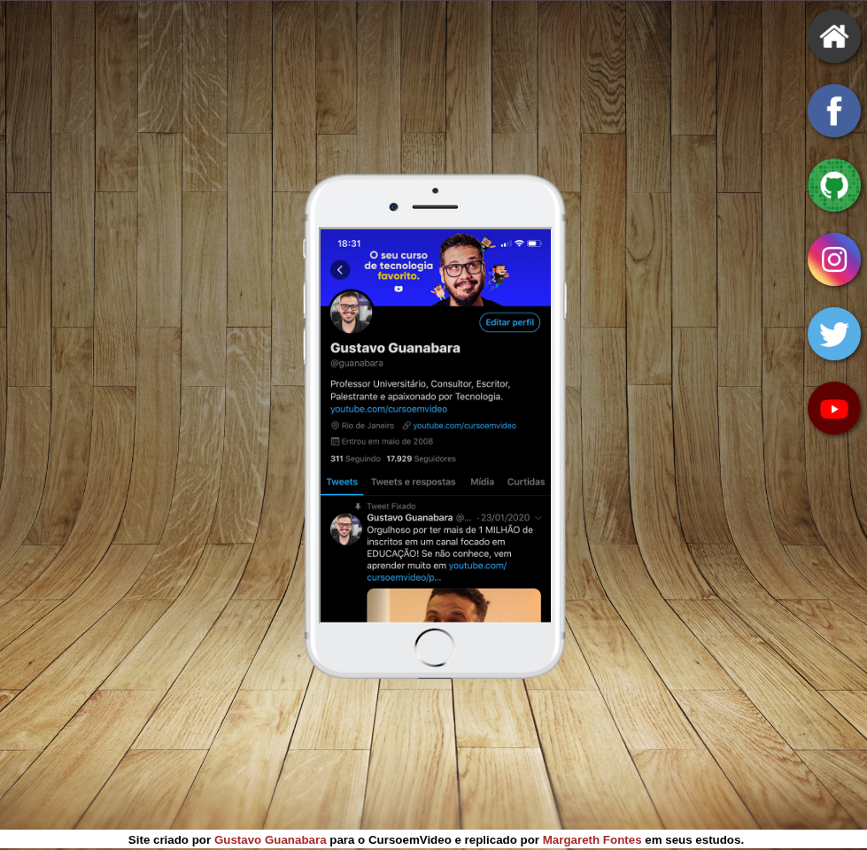

# 📱 Project Social Media

Project developed during the **HTML5 and CSS3** course by **Gustavo Guanabara**, with the goal of practicing concepts related to **iframes**, positioning, and styling using only HTML and CSS.

## Go take a look👀: https://mfontes42.github.io/Project_Social_Media/

## 🖼️ Preview

  

## 📌 About the Project

**Project Social Media** simulates a social media page displayed through a smartphone. The interface features a centered smartphone, and inside it there is an area that uses an **iframe** to display different pages and content.

The social media icons used in the project correspond to the social networks and pages of **Gustavo Guanabara**, following the original exercise proposed in the course.

This project is part of my learning journey in web development and was developed with a focus on practicing the concepts presented throughout the course.

## 🎯 Objectives

* Practice using **iframes** in HTML.
* Understand how to embed one page inside another.
* Work with element positioning using CSS.
* Use images as interface elements.
* Practice backgrounds and properties such as `background-size` and `background-position`.
* Work with `hover` effects.
* Practice organizing and styling a webpage using pure CSS.
* Develop an initial approach to responsiveness without using Media Queries.

## 🧩 Concepts Practiced

### HTML

* Basic semantic structure.
* Image elements.
* Links.
* `iframe`.
* Attributes related to embedded content.

### CSS

* Basic reset using `*`.
* `relative` and `absolute` positioning.
* Centering with `transform`.
* Background images.
* `background-size: cover`.
* `background-position`.
* `background-attachment`.
* `border-radius`.
* `box-shadow`.
* `:hover` pseudo-class.
* Element sizing and positioning.
* Responsiveness using relative units.

## 🖥️ Technologies Used

The project was developed **exclusively with HTML5 and CSS3**, without JavaScript, frameworks, or external libraries.

## 📱 Responsiveness

The current version of the project was built using pure HTML and CSS and **does not use Media Queries yet**.

Relative values and positioning techniques were mainly used to allow the elements to adapt better to different screen sizes.

> 🚧 Media Queries may be added later as part of the project's evolution and my continued study of responsive web design.

## 📚 Course

This project was developed as part of the **HTML5 and CSS3** course taught by:

**Gustavo Guanabara**

The exercise was used to put the concepts studied during the lessons into practice, especially the functionality and use of **iframes**.

## 👩‍💻 Author

**Margareth Fontes**

Project developed for **web development study and practice**.

---

⭐ Project created during my learning journey in **HTML5 and CSS3**.
